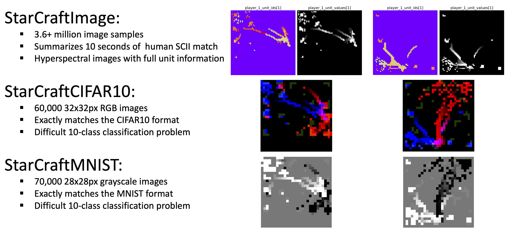
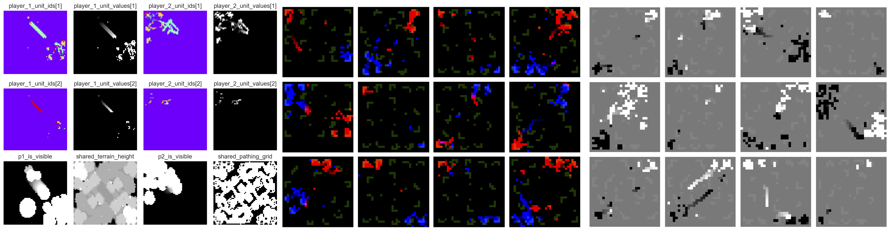

---
# Leave the homepage title empty to use the site title
title:
date: 2022-3-26
type: landing

sections:
  - block: markdown
    content:
      title: StarCraftImage
      subtitle: Dataset and code 
      text: |-
        <figure style="max-width:930px; margin:auto;">
            
        </figure>

        StarCraftImage is a large-scale easy-to-use spatial reasoning dataset that includes 3.6 million images that summarize 10-second windows of human-played matches from the StarCraft II video game.
        This work was presented in CVPR 2023: [StarCraftImage: A Dataset For Prototyping Spatial Reasoning Methods For Multi-Agent Environments](https://arxiv.org/abs/2401.04290)

        

            

                <a href="/docs/">
                    <h3>Get Started</h3>
                </a>
            

            

                <a target="_blank" href="https://github.com/inouye-lab/starcraftimage">
                    <h3>GitHub Repo</h3>
                </a>
            

            

                <a target="_blank" href="https://arxiv.org/abs/2401.04290">
                    <h3>CVPR 23' Paper</h3>
                </a>
            

        

        The image below showcases additional examples from StarCraftImage including the hyperspectral format that includes all unit type information at a resolution of 64 x 64 (left), the RGB format that matches CIFAR10 at a resolution of 32 x 32 (middle) and the grayscale format that matches MNIST at a resolution of 28 x 28.

        <figure style="margin-top:2em;">
            
        </figure>

        
    design:
      # See Page Builder docs for all section customization options.
      # Choose how many columns the section has. Valid values: '1' or '2'.
      columns: '1'
#   - block: portfolio
#     id: Documentation
#     content:
#       text: |-
#       filters:
#         # Folders to display content from
#         folders:
#           - docs
#           - github
#         # Only show content with these tags
#         tags: []
#         # Exclude content with these tags
#         exclude_tags: []
#         # Which Hugo page kinds to show (https://gohugo.io/templates/section-templates/#page-kinds)
#         kinds:
#           - project
#           - link
#           - page
#       # Field to sort by, such as Date or Title
#       sort_by: 'Date'
#       sort_ascending: false
#     design:
#       # See Page Builder docs for all section customization options.
#       # Choose how many columns the section has. Valid values: '1' or '2'.
#       columns: '2'
#       # Choose a listing view
#       view: card
#       # For Showcase view, flip alternate rows?
#       flip_alt_rows: false
---
